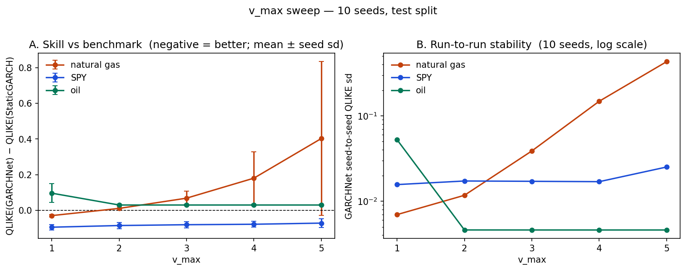

# deepgarch

**Does conditioning GARCH parameters on market state improve volatility forecasts?**

GARCH(1,1) holds `(ω, α, β)` constant. This project makes them a
function of observable state: a small MLP maps lagged returns, realised
volatility, volume and exogenous series to daily `(ω, α, β)`. It trains
by backpropagating through the variance recursion. 

Benchmarked against
static GARCH, GJR-GARCH, EGARCH and EWMA on SPY, natural gas (`NG=F`) and WTI
crude (`CL=F`), across 10 seeds.

The first version underestimated variance by
2.6x on natural gas. A calibration diagnostic localised the failure to one
component (the conditional level head), and a sweep over the single parameter
governing that component's freedom recovered the result: natural gas went from
worst to best of five models, with a 5.6x drop in seed-to-seed variance. 

On SPY and oil the model is inside the model confidence set but not separable
from the GARCH family.

---

## Model

The MLP emits three unbounded reals per day. `_constrain_path` maps them to
valid GARCH parameters:

```
ρ  = max_persistence · sigmoid(ρ_raw)          persistence (α+β), capped < 1
α  = ρ · s_max · sigmoid(φ_raw)                 share of ρ on the shock term
β  = ρ − α
σ̄² = exp(v₀ + v_max · tanh(v_raw / v_max))      long-run variance level
ω  = (1 − ρ) · σ̄²                               variance targeting
```

Stationarity holds by construction: `ω > 0`, `α, β > 0`, `α + β <
max_persistence`. The recursion `h_t = ω_t + α_t r²_{t−1} + β_t h_{t−1}` runs on
top, trained on Gaussian NLL.

**Why variance targeting.** Estimating `ω` directly is not ideal: it's a small value
(~1e−5) and strongly coupled to `ρ`, as `σ̄² = ω/(1−ρ)`. At `ρ = 0.999` a 1%
error in `ω` moves the long-run level by 10x, so the likelihood surface
is a long thin ridge. Reparameterising to `(σ̄², ρ)` rotates the ridge into two near-orthogonal
directions. `v₀ = log(train-set unconditional variance)`, so the network starts
at the historical level and learns log-deviations from it. `v_max` bounds those
deviations to a factor of `exp(v_max)` in either direction.

**Leakage.** Every feature in `features/pipeline.py` is `.shift(1)`-lagged. The
one deliberate exception is `is_eia_day`, shifted `−1`: the recursion consumes
row `t−1`'s parameters to produce `σ²_t`, so the storage-release flag must sit
on the row before the release. `fit_initial_variance` seeds the recursion from
train returns only, so no val/test variance enters the initial condition.

## The `v_max` result

`v_max` was introduced as a safety rail against `exp()` overflow and initially left at
3.0. On natural gas the level head used the whole band,
swinging `σ̄²` from 5.1e−5 to 2.0e−2 across the test split. I tightened this to 1.0 following a
sweep over a range of `v_max` values. This change measurably improved the model.

| `v_max` | natgas QLIKE | `mean_z2` |
|---:|---:|---:|
| 1.0 | **−5.5053** | **1.51** |
| 2.0 | −5.4581 | 1.90 |
| 3.0 | −5.4097 | 2.29 |
| 4.0 | −5.4059 | 2.23 |
| 5.0 | −5.4041 | 2.22 |



Tightening `v_max` also cut the natgas
seed-to-seed QLIKE sd from 0.0389 to 0.0070, a 5.6x improvement: the level head
was seemingly a source of run-to-run instability.

## Results

10 seeds per market, mean ± sd; baselines are deterministic `arch` fits and
carry no seed variation. QLIKE and MSE score against **Parkinson range
variance**, `(ln(high/low))²/(4 ln 2)` — unbiased for daily variance and far
less noisy than squared returns. Violations test realised returns against the
forecast distribution and are unaffected by the proxy choice.

| Market | Model | QLIKE (mean ± sd) | Violations (α=1%) | Kupiec p |
|---|---|---:|---:|---:|
| **Natgas** (n=1423) | **GARCHNet** | **−5.5107 ± 0.0070** | 1.55% | 0.087 |
| | EGARCH | −5.5039 | 1.12% | 0.644 |
| | Static GARCH | −5.4812 | 1.19% | 0.474 |
| | GJR-GARCH | −5.4727 | 1.34% | 0.227 |
| | EWMA | −5.4554 | 1.05% | 0.839 |
| **SPY** (n=313) | EGARCH | −9.0683 | 1.92% | 0.148 |
| | GARCHNet | −9.0633 ± 0.0157 | 1.25% | 0.666 |
| | GJR-GARCH | −9.0224 | 1.28% | 0.636 |
| | EWMA | −8.9856 | 1.28% | 0.636 |
| | Static GARCH | −8.9689 | 1.28% | 0.636 |
| **Oil** (n=229) | Static GARCH | −6.0339 | 2.62% | 0.040 |
| | GARCHNet | −6.0038 ± 0.0046 | 3.14% | 0.010 |
| | EWMA | −5.9547 | 2.62% | 0.040 |
| | GJR-GARCH | −5.8246 | 3.93% | 0.001 |
| | EGARCH | −5.5915 | 3.93% | 0.001 |

Per-seed numbers in `results/sweep/summary.csv`; DM and MCS aggregates in
`results/sweep/significance.json`.

**Natural gas.** Best QLIKE of all five models, and the lowest
variance MSE by a wide margin (1.17e−5 vs 1.87e−5 for static GARCH). Beats the
benchmark on 10/10 seeds by DM sign. VaR
coverage is a weakness: 1.55% against 1% nominal, Kupiec p = 0.087,
with `mean_z2` still at 1.50.

**SPY.** −9.0633 ± 0.0157 against EGARCH's −9.0683 — a gap of 0.005 against a
seed sd three times larger - generally speaking a tie. GARCHNet beats static GARCH with
DM p < 0.001 on 10/10 seeds and is in the QLIKE MCS on 10/10, but so are EGARCH,
GJR and EWMA; only static GARCH is excluded. Competitive with the family but not especially
distinguishable from it.

**Oil.** Second behind static GARCH, ahead of EWMA, GJR and EGARCH, with the
tightest seed spread (sd 0.0046). Every model fails VaR coverage here. The test
split is short (229 days) and ends earlier than the other two markets.


## Method notes

- **Splits.** Train / validation / test by date, per config. Architecture,
  parameterisation and `v_max` were selected on validation; the test split is a
  single final look.
- **Significance.** Diebold–Mariano on per-observation QLIKE with Bartlett /
  Newey–West HAC long-run variance. Forecast losses are autocorrelated, so
  naive standard errors over-reject. Model Confidence Set on top, to handle
  comparing five models at once. Both reported per-seed and on the seed-averaged
  loss series.
- **Seeds.** Everything headline is 10 seeds. Baselines are deterministic, so
  their sd is exactly zero by construction.

## Install

```bash
conda env create -f environment.yml && conda activate deepgarch
# or: pip install -e .
```

## Run

```bash
python run.py --config configs/spy.yaml       # also: natgas, oil, *_ablate
python sweep.py                                # 3 markets x seeds 0-9
python sweep.py --v-max 1 2 3 4 5 --seeds 0 1 2
python sweep.py --aggregate-only               # rebuild summaries, no training
pytest
```

Each run writes plots, `comparison_metrics.json`, `parameter_path.csv`,
`loss_series.csv` (per-observation QLIKE/MSE for every model),
`significance.json` and a `*_model.pt` checkpoint to `output.dir`. Sweeps land in
`results/sweep/[vmax_<v>/]<market>/seed_<n>/`, aggregated to `summary.csv` and
`significance.json` at the sweep root.

## Layout

```
src/deepgarch/
  models/cond_garchnet.py   parameter constraints + variance recursion
  models/nn/paramnet.py     the MLP
  features/pipeline.py      lagged feature construction
  eval/metrics.py           QLIKE, MSE, VaR backtest, calibration
  eval/tests.py             Diebold-Mariano, Christoffersen, MCS
  eval/baselines.py         arch-fitted GARCH / GJR / EGARCH / EWMA
  data/                     yfinance loader, EIA release calendar + storage
run.py / sweep.py           single run / seed and v_max sweeps
configs/                    one YAML per market, plus *_ablate variants
```

## License

MIT — see `LICENSE`.